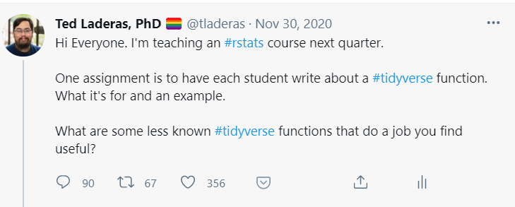
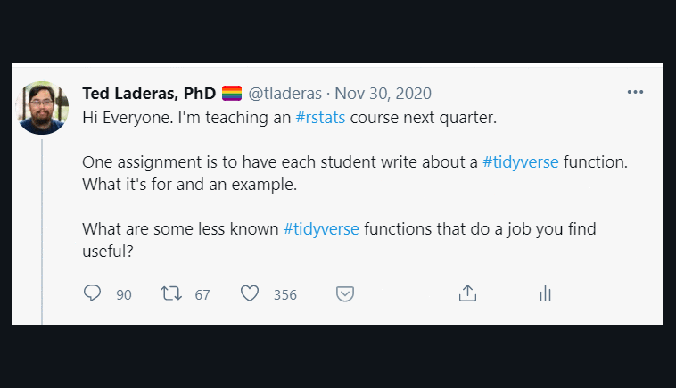

```{r setup, include=FALSE}
options(htmltools.dir.version = FALSE)
```

```{r xaringan-themer, include=FALSE, warning=FALSE}
library(xaringanthemer)
style_mono_accent(
  base_color = "midnightblue",
  header_font_google = google_font("Josefin Sans"),
  link_color = "steelblue",
  text_font_size = "26px",
  footnote_font_size = "22px"
)
```
class: center, middle
# Our Goal: Help students learn the `tidyverse` with each other
## (And spend less time lecturing)

---
# Step 1: Ask #RStats Twitter for Help

```{r echo=FALSE}

```

---
# Step 1b: Get responses



---
# Step 2: Collate Useful Functions

.pull-left[
- Over 266 recommendations!
- Here are the top ten:
]

.pull-right[
```{r echo=FALSE, warning=FALSE, message=FALSE}
library(gt)
library(dplyr)
tweets <- readr::read_csv("data/cleaned_tweets.csv")

tweets %>% tidyr::drop_na(funcs) %>% count(funcs) %>%
  arrange(desc(n)) %>%
  slice(1:10) %>%
  gt()
```
]
---
# Step 3: Sign up & Present 

<image src="image/assignment.png" width = 900>

---
# Step 4: Recieve Gratitude, Repeat the Virtuous Cycle

- `17:39:17	 From  JK : Thanks JT, super helpful!`
- `17:45:47	 From  SS : Awesome! Thanks`
- `17:45:48	 From  KL : Great job both of you!!`
- `17:46:04	 From  BK : Thanks to both of you. Great job.`

---
# What did we learn?

- [#Rstats twitter is awesome - thank you!](https://laderast.github.io/articles/tidyverse_functions/)
- [Sharing cool functions can drive learning and empower students](https://sph-r-programming.netlify.app/functions)
- gRatitude from fellow students is a good motivator to learn

Thanks to the BSTA 504 Students!

---
class: center, middle
# https://laderast.github.io/gratitude_talk

## https://ready4r.netlify.app

